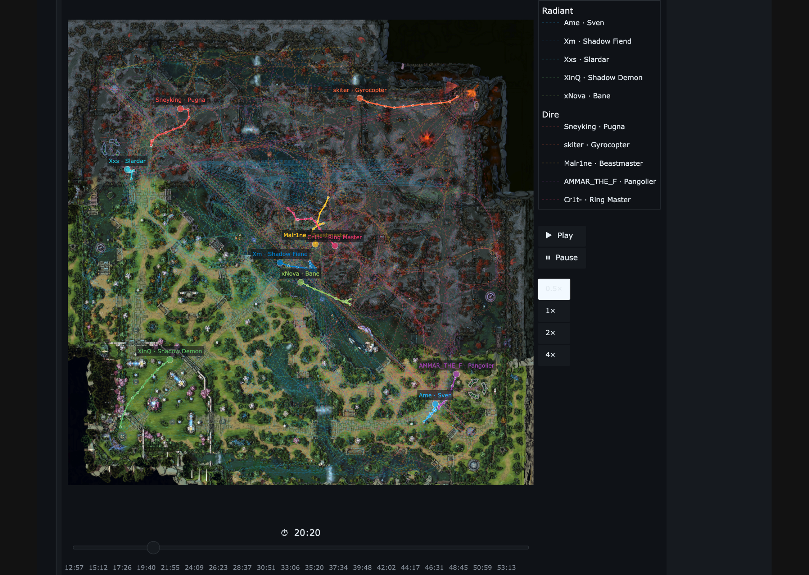
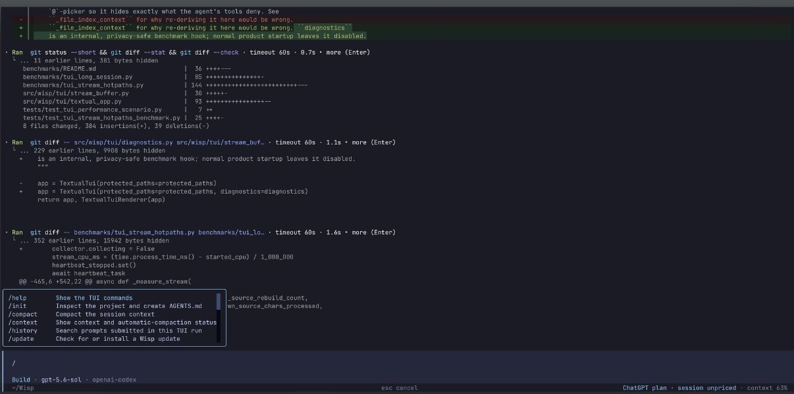

<h1 align="center">
  
</h1>

  
  

I build applied AI systems — agents, data tools, and LLM applications that hold up in production.

## Notable projects

### [gem-dota](https://github.com/whanyu1212/gem-dota)

From replay bytes to player paths, teamfights, and match insights. A Python parser that turns Dota 2 `.dem` files into DataFrames, JSON, Parquet, and interactive HTML reports.

  
   
  Player movement reconstructed from a replay. Open the sample report to explore.

[Code →](https://github.com/whanyu1212/gem-dota) · [Docs →](https://whanyu1212.github.io/gem-dota/) · [Sample report →](https://whanyu1212.github.io/gem-dota/reports/)

### [Wisp](https://github.com/whanyu1212/Wisp)

A coding agent with resumable sessions, approval controls, and inspectable transcripts. One shared runtime across terminal, RPC, and SDK interfaces.

  
   
  Code changes, tool output, and session commands in the terminal.

[Code →](https://github.com/whanyu1212/Wisp)

### More projects

| Project | What I'm building |
| :--- | :--- |
| [Krill.jl](https://github.com/whanyu1212/Krill.jl) | A Julia-native AI agent runtime for Telegram and Discord, with persistent memory, scheduled tasks, MCP tools, and coding-agent delegation. In active development. |
| [OpenCouch](https://github.com/whanyu1212/OpenCouch) | A pre-beta AI companion for self-reflection and guided wellness exercises, with persistent memory and safety routing. |
| [QuantRL-Lab](https://github.com/whanyu1212/QuantRL-Lab) | A Python testbed for reinforcement learning in quantitative trading, with pluggable action, observation, and reward strategies. |

## Open source

**[ai-agent-book](https://github.com/bojieli/ai-agent-book)** · contributor

One of the [top contributors](https://github.com/bojieli/ai-agent-book/graphs/contributors) to Bojie Li's open-source book on AI agent design and engineering. My contributions span English translation improvements, chapter experiment organization, Python dependency consistency, and test refactoring.

[Read the English edition →](https://github.com/bojieli/ai-agent-book/blob/main/docs/en/README.md) · [My merged contributions →](https://github.com/bojieli/ai-agent-book/pulls?q=is%3Apr+is%3Amerged+author%3Awhanyu1212)

## Toolbox

## Exploring

- AI agents and LLM-powered applications
- Reinforcement learning and quantitative finance
- Rust and Julia for high-performance computing

## Updates

<!-- Curated milestones: keep three dated releases or merged contributions, newest first. -->

- **2026-09-04 · [gem-dota v0.7.1](https://github.com/whanyu1212/gem-dota/releases/tag/v0.7.1)** — Improved full-replay parsing performance while preserving normalized output, and added reproducible replay fixtures for integration tests.
- **2026-08-23 · [Wisp v0.1.0](https://github.com/whanyu1212/Wisp/releases/tag/v0.1.0)** — Released terminal steering and follow-up controls, reduced tool-output flicker, and streamlined startup.
- **2026-07-31 · [ai-agent-book contribution](https://github.com/bojieli/ai-agent-book/pull/425)** — Merged shared provider infrastructure, chapter dependency setup, and experiment-structure improvements into the upstream book.

## Arcade

