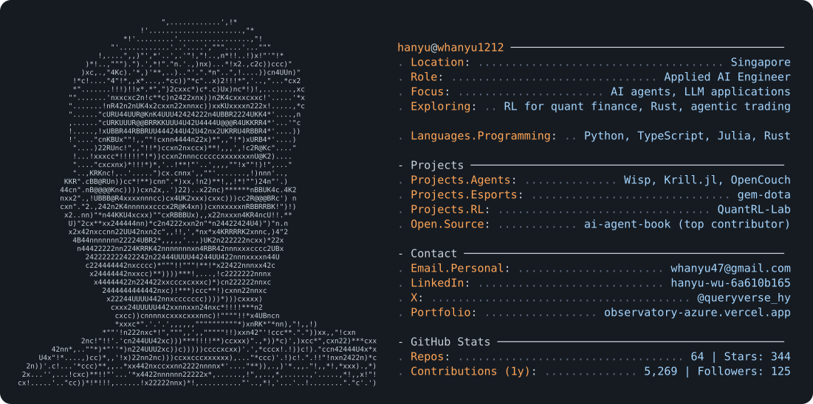

  

  <a href="https://www.linkedin.com/in/hanyu-wu-6a610b165/">LinkedIn</a> ·
  <a href="mailto:whanyu47@gmail.com">Email</a> ·
  <a href="https://observatory-azure.vercel.app/">Portfolio</a>

<code>[process completed]</code> · thanks for stopping by

