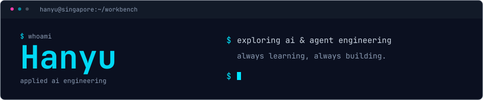

<h1 align="center">
  
</h1>

  
  

I build applied AI systems — agents, data tools, and LLM applications that hold up in production.

## Projects

**[gem-dota](https://github.com/whanyu1212/gem-dota)** · featured

Turn Dota 2 replays into data you can work with. Gem is a Python replay parser that extracts player state, combat events, and match timelines from `.dem` files, exports DataFrames, JSON, and Parquet, and generates HTML reports for match analysis.

[Code →](https://github.com/whanyu1212/gem-dota) · [Docs →](https://whanyu1212.github.io/gem-dota/) · [Sample report →](https://whanyu1212.github.io/gem-dota/reports/)

| Project | What I'm building |
| :--- | :--- |
| [Wisp](https://github.com/whanyu1212/Wisp) | A coding agent with resumable sessions, approval controls, and inspectable transcripts, powered by one shared runtime across terminal, RPC, and SDK interfaces. |
| [Krill.jl](https://github.com/whanyu1212/Krill.jl) | A Julia-native AI agent runtime for Telegram and Discord, with persistent memory, scheduled tasks, MCP tools, and coding-agent delegation. In active development. |
| [OpenCouch](https://github.com/whanyu1212/OpenCouch) | A pre-beta AI companion for self-reflection and guided wellness exercises, with persistent memory and safety routing. |
| [QuantRL-Lab](https://github.com/whanyu1212/QuantRL-Lab) | A Python testbed for reinforcement learning in quantitative trading, with pluggable action, observation, and reward strategies. |

## Open source

**[ai-agent-book](https://github.com/bojieli/ai-agent-book)** · contributor

One of the [top contributors](https://github.com/bojieli/ai-agent-book/graphs/contributors) to Bojie Li's open-source book on AI agent design and engineering. My contributions span English translation improvements, chapter experiment organization, Python dependency consistency, and test refactoring.

[Read the English edition →](https://github.com/bojieli/ai-agent-book/blob/main/docs/en/README.md) · [My merged contributions →](https://github.com/bojieli/ai-agent-book/pulls?q=is%3Apr+is%3Amerged+author%3Awhanyu1212)

## Toolbox

## Exploring

- AI agents and LLM-powered applications
- Reinforcement learning and quantitative finance
- Rust and Julia for high-performance computing

## Arcade

## Stats

  

## Activity

<!--RECENT_ACTIVITY:start-->
1. ⬆️ Pushed to [whanyu1212/Wisp](https://github.com/whanyu1212/Wisp) 
2. ✔️ Closed issue [#163](https://github.com/whanyu1212/gem-dota/issues/163) in [whanyu1212/gem-dota](https://github.com/whanyu1212/gem-dota) 
3. ⬆️ Pushed to [whanyu1212/Wisp](https://github.com/whanyu1212/Wisp) 
4. 💪 Opened PR [#171](undefined) in [whanyu1212/gem-dota](https://github.com/whanyu1212/gem-dota) 
5. 💪 Opened PR [#509](undefined) in [whanyu1212/Wisp](https://github.com/whanyu1212/Wisp) 
<!--RECENT_ACTIVITY:end-->
<!--RECENT_ACTIVITY:last_update-->
Last Updated: Saturday, September 5th, 2026, 7:38:25 PM
<!--RECENT_ACTIVITY:last_update_end-->
