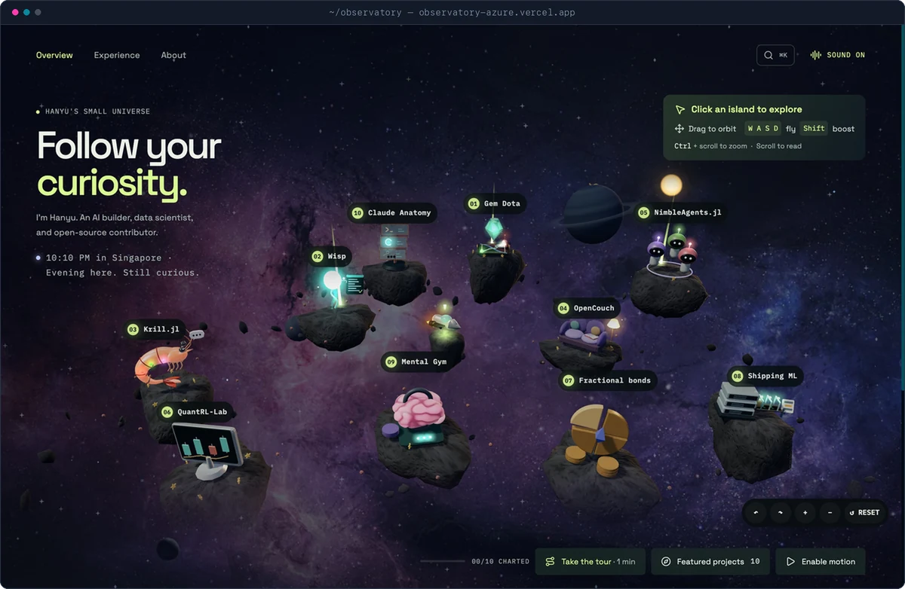
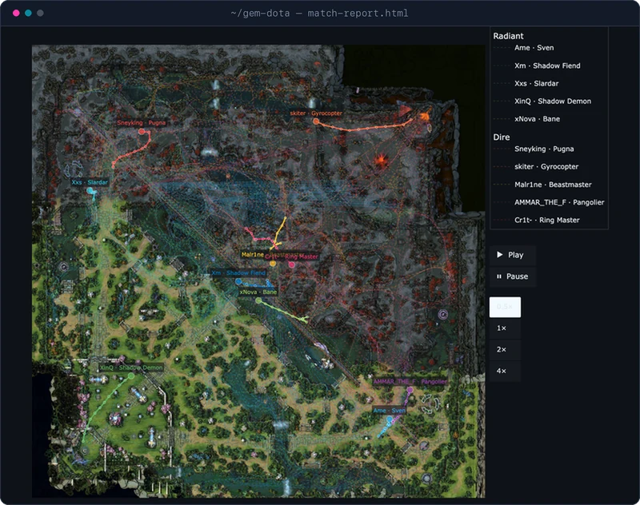
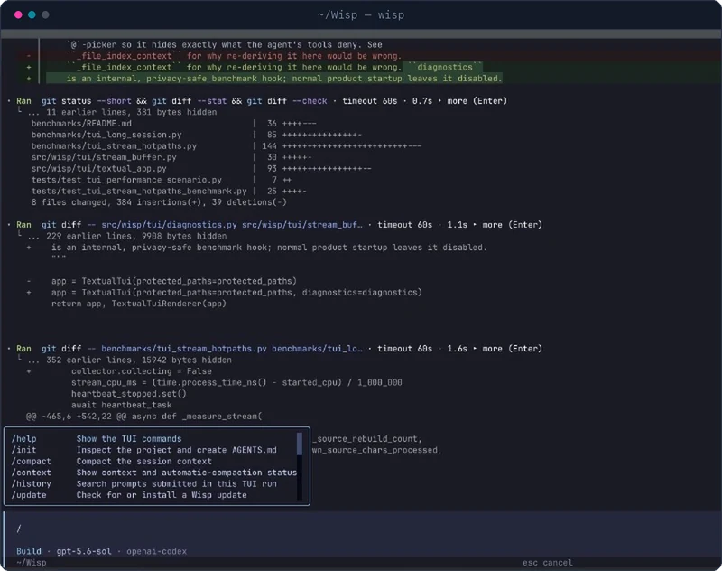
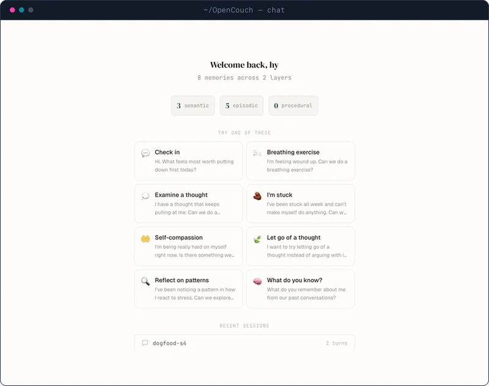
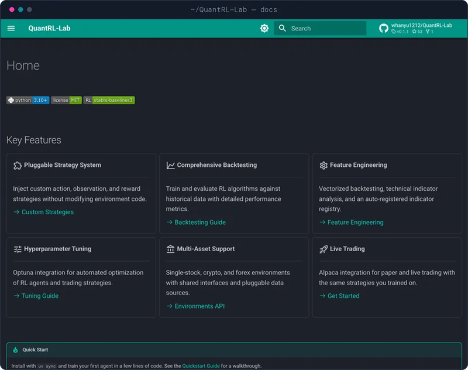

<h1 align="center">
  
</h1>

  
  
  &nbsp;&nbsp;
  
  
  

I build applied AI systems — agents, data tools, and LLM applications that hold up in production. I'm also one of the top contributors to [ai-agent-book](https://github.com/bojieli/ai-agent-book), a 50k★ open-source book on agent engineering.

**Currently exploring:** AI agents and LLM-powered applications · reinforcement learning for quantitative finance · Rust and Julia for high-performance computing.

## ~/universe

  

My portfolio as a small, explorable universe: fly between project islands. Built with Astro, React, and Three.js. 
  <a href="https://observatory-azure.vercel.app/">Explore it →</a> · <a href="https://github.com/whanyu1212/observatory">Code →</a>

## ~/projects

<table>
  <tr>
    <td width="50%" valign="top">
      <h3>
        <a href="https://github.com/whanyu1212/gem-dota">gem-dota</a>
        
      </h3>
      

        
      

      
From replay bytes to player paths, teamfights, and match insights. A Python parser that turns Dota 2 <code>.dem</code> files into DataFrames, JSON, Parquet, and interactive HTML reports.

      

        <a href="https://github.com/whanyu1212/gem-dota">Code →</a> ·
        <a href="https://whanyu1212.github.io/gem-dota/">Docs →</a> ·
        <a href="https://whanyu1212.github.io/gem-dota/reports/">Sample report →</a>
      

    </td>
    <td width="50%" valign="top">
      <h3>
        <a href="https://github.com/whanyu1212/Wisp">Wisp</a>
        
      </h3>
      

        
      

      
A coding agent with resumable sessions, approval controls, and inspectable transcripts. One shared runtime across terminal, RPC, and SDK interfaces.

      

        <a href="https://github.com/whanyu1212/Wisp">Code →</a> ·
        <a href="https://github.com/whanyu1212/Wisp/releases">Releases →</a>
      

    </td>
  </tr>
  <tr>
    <td width="50%" valign="top">
      <h3>
        <a href="https://github.com/whanyu1212/OpenCouch">OpenCouch</a>
        
      </h3>
      

        
      

      
A pre-beta AI companion for self-reflection and guided wellness exercises, with layered memory and safety routing.

      

        <a href="https://github.com/whanyu1212/OpenCouch">Code →</a> ·
        <a href="https://whanyu1212.github.io/OpenCouch/">Docs →</a>
      

    </td>
    <td width="50%" valign="top">
      <h3>
        <a href="https://github.com/whanyu1212/QuantRL-Lab">QuantRL-Lab</a>
        
      </h3>
      

        
      

      
A reinforcement learning testbed for quantitative trading, with pluggable action, observation, and reward strategies.

      

        <a href="https://github.com/whanyu1212/QuantRL-Lab">Code →</a> ·
        <a href="https://whanyu1212.github.io/QuantRL-Lab/">Docs →</a>
      

    </td>
  </tr>
</table>

**Also building:** [Krill.jl](https://github.com/whanyu1212/Krill.jl), a Julia-native agent runtime for Telegram and Discord with persistent memory, scheduled tasks, MCP tools, and coding-agent delegation.

## ~/open-source

**[ai-agent-book](https://github.com/bojieli/ai-agent-book)** · contributor 

One of the [top contributors](https://github.com/bojieli/ai-agent-book/graphs/contributors) to Bojie Li's open-source book on AI agent design and engineering. My contributions span English translation improvements, chapter experiment organization, Python dependency consistency, and test refactoring.

[Read the English edition →](https://github.com/bojieli/ai-agent-book/blob/main/docs/en/README.md) · [My merged contributions →](https://github.com/bojieli/ai-agent-book/pulls?q=is%3Apr+is%3Amerged+author%3Awhanyu1212)

## ~/changelog

<!-- Generated by scripts/update_changelog.py on a schedule; edits between the markers are overwritten. -->
<!-- changelog:start -->
- **2026-09-18 · [ai-agent-book #1085](https://github.com/bojieli/ai-agent-book/pull/1085)** — Merged upstream: Fix agent-loop animation and responsive connectors.
- **2026-09-17 · [Wisp v0.2.0rc3](https://github.com/whanyu1212/Wisp/releases/tag/v0.2.0rc3)** — RC3 makes Rust the sole interactive terminal interface.
- **2026-09-07 · [gem-dota v0.8.0](https://github.com/whanyu1212/gem-dota/releases/tag/v0.8.0)** — Reduces parser lookup, decoding, and sampling overhead and bounds outstanding replay results during batch Parquet export.
<!-- changelog:end -->

## ~/arcade

<code>[process completed]</code> · thanks for stopping by

