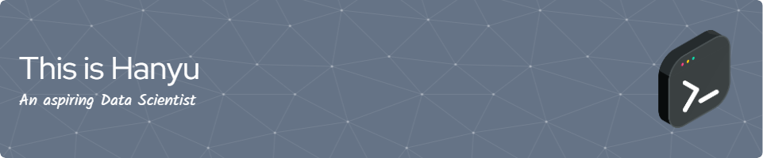

<h1> Hi, Welcome to my workspace! </h1>

<em>Data Scientist at <a href="https://sg.micron.com/">Micron Technology Singapore</a>

<em>Master of Science in DFinTech, B.S. in Statistics from <a href="https://nus.edu.sg/">National University of Singapore</a>
<!--
**whanyu1212/whanyu1212** is a ✨ _special_ ✨ repository because its `README.md` (this file) appears on your GitHub profile.

Here are some ideas to get you started:

- 🔭 I’m currently working on ...
- 🌱 I’m currently learning ...
- 👯 I’m looking to collaborate on ...
- 🤔 I’m looking for help with ...
- 💬 Ask me about ...
- 📫 How to reach me: ...
- 😄 Pronouns: ...
- ⚡ Fun fact: ...
-->
